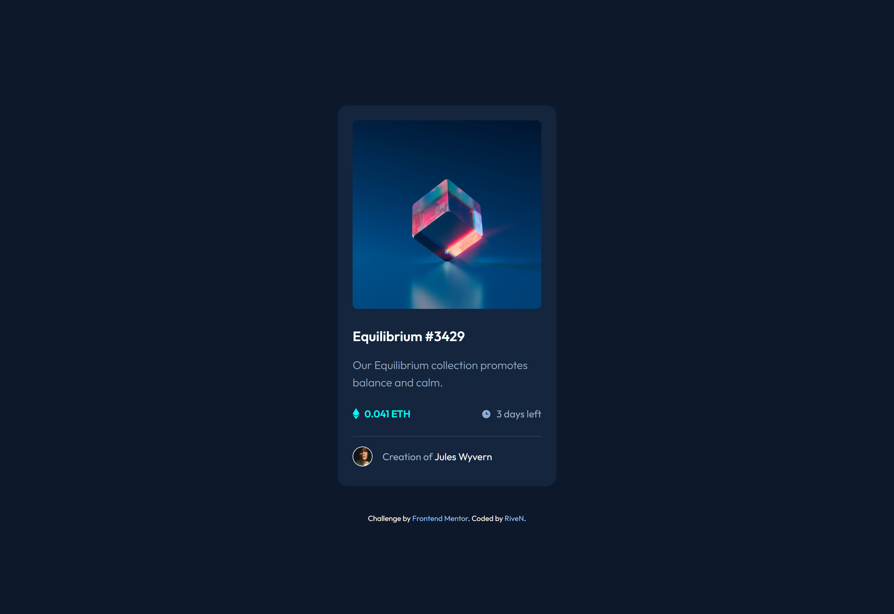
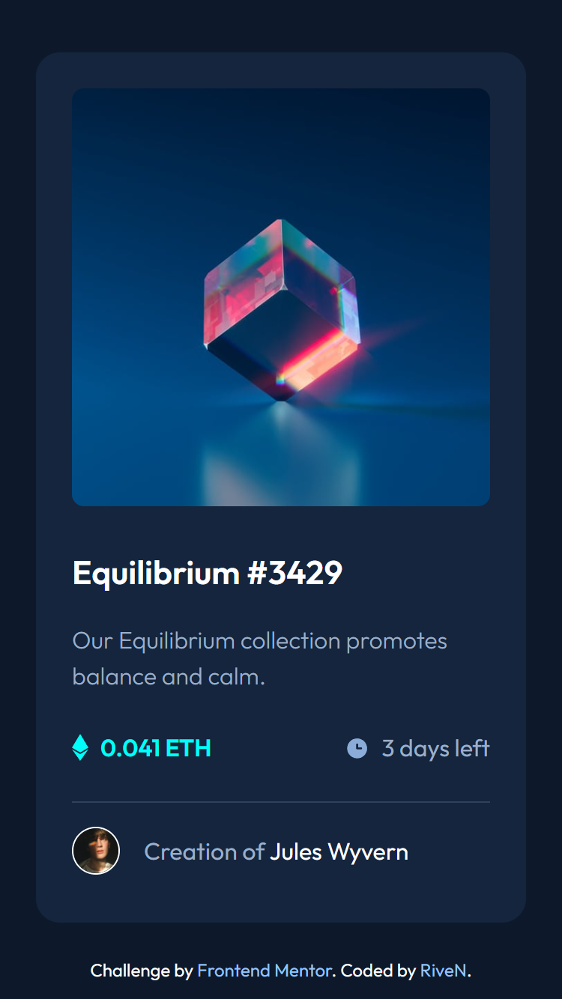

# Frontend Mentor - NFT preview card component solution

This is my solution to the [NFT preview card component challenge on Frontend Mentor](https://www.frontendmentor.io/challenges/nft-preview-card-component-SbdUL_w0U).


## Table of contents

- [Overview](#overview)
  - [Challenge](#challenge)
  - [Solution](#solution-live-solution-url)
- [My process](#my-process)
  - [Built with](#built-with)
  - [What I learned](#what-i-learned)
- [Author/Links](#authorlinks)

## Overview

### Challenge

Your challenge is to build out this preview card component and get it looking as close to the design as possible.

Your users should be able to:

- View the optimal layout depending on their device's screen size
- See hover states for interactive elements

| Desktop Design | Mobile Design |
| --- | --- |
|  |  |

### Solution ([Live Solution URL](https://rivenintech.github.io/frontend-mentor-solutions/nft-preview-card-component/))

| Desktop Design (solution) | Mobile Design (solution) |
| --- | --- |
|  |  |

## My process

### Built with

- HTML
- [TailwindCSS](https://tailwindcss.com/)

### What I learned

I learned how to create overlay hover effect using TailwindCSS, thanks to this tutorial: [https://www.kindacode.com/snippet/tailwind-css-create-image-hover-overlay-effects/](https://www.kindacode.com/snippet/tailwind-css-create-image-hover-overlay-effects/)

```html
<div class="group relative">
  
  <div class="absolute top-0 w-full h-full bg-cyan bg-opacity-0 group-hover:bg-opacity-50 duration-300">
    ...
  </div>
</div>
```

## Author/Links

- [Live Solution URL](https://rivenintech.github.io/frontend-mentor-solutions/nft-preview-card-component/)
- My Website - [rivenintech.com](https://rivenintech.com)
- GitHub - [@rivenintech](https://github.com/rivenintech)
- Frontend Mentor Profile - [@rivenintech](https://www.frontendmentor.io/profile/rivenintech)
