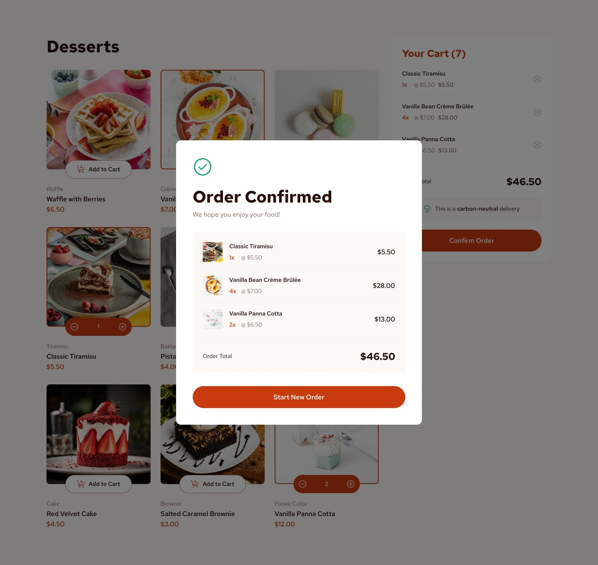

# Frontend Mentor - Product list with cart solution

This is my solution to the [Product list with cart challenge on Frontend Mentor](https://www.frontendmentor.io/challenges/product-list-with-cart-5MmqLVAp_d).

## Table of contents

- [Overview](#overview)
  - [Challenge](#challenge)
  - [Solution](#solution-live-solution-url)
- [My process](#my-process)
  - [Built with](#built-with)
- [Author/Links](#authorlinks)

## Overview

### Challenge

| Desktop Design | Mobile Design |
| --- | --- |
|  |  |

Your challenge is to build out this Product list with cart and get it looking as close to the design as possible.

### Solution ([Live Solution URL](https://frontend-mentor.rivenintech.com/product-list-with-cart/))

| Desktop Design (solution) | Mobile Design (solution) |
| --- | --- |
|  |  |

## My process

### Built with

- HTML
- [TailwindCSS](https://tailwindcss.com/)
- React
- Astro
- Shadcn/ui

## Author/Links

- [Live Solution](https://frontend-mentor.rivenintech.com/product-list-with-cart/)
- [Source Code](https://github.com/rivenintech/frontend-mentor-solutions/tree/main/product-list-with-cart/)
- My Website - [rivenintech.com](https://rivenintech.com)
- Frontend Mentor Profile - [@rivenintech](https://www.frontendmentor.io/profile/rivenintech)
