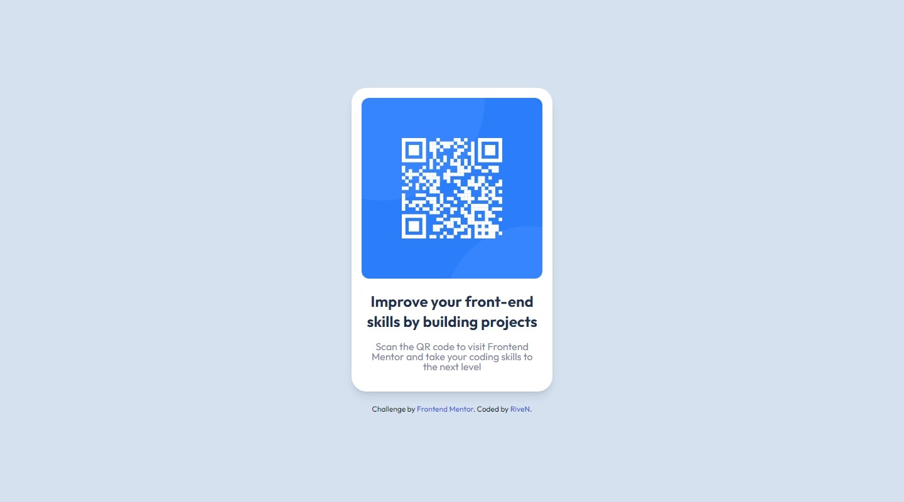

# Frontend Mentor - QR code component solution

This is my solution to the [QR code component challenge on Frontend Mentor](https://www.frontendmentor.io/challenges/qr-code-component-iux_sIO_H).


## Table of contents

- [Overview](#overview)
  - [Challenge](#challenge)
  - [Solution](#solution-live-solution-url)
- [My process](#my-process)
  - [Built with](#built-with)
  - [What I learned](#what-i-learned)
- [Author/Links](#authorlinks)

## Overview

### Challenge

Your challenge is to build out this QR code component and get it looking as close to the design as possible.

| Desktop Design | Mobile Design |
| --- | --- |
|  |  |

### Solution ([Live Solution URL](https://rivenintech.github.io/frontend-mentor-solutions/qr-code-component/))

| Desktop Design (solution) | Mobile Design (solution) |
| --- | --- |
|  |  |

## My process

### Built with

- HTML
- [TailwindCSS](https://tailwindcss.com/) (mainly flexbox, paddings, margins)

### What I learned

I learned how to deconstruct a design into smaller parts and then join them together to form the whole design. I also realized that you can use flexbox to center an element vertically and horizontally. My first thought would be to use `position: absolute`.

```html
<!-- Container to center the card -->
<div class="flex justify-center items-center h-screen">
  <!-- Card -->
</div>
```

## Author/Links

- [Live Solution URL](https://rivenintech.github.io/frontend-mentor-solutions/qr-code-component/)
- My Website - [rivenintech.com](https://rivenintech.com)
- Twitter - [@rivenintech](https://www.twitter.com/rivenintech)
- Frontend Mentor Profile - [@RiveN000](https://www.frontendmentor.io/profile/RiveN000)
